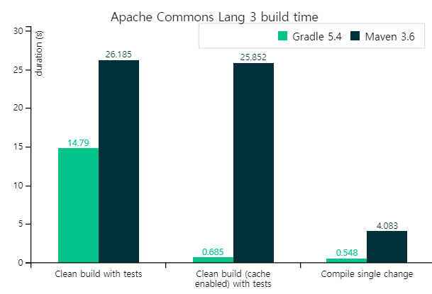

# 1. 인텔리제이로 스프링 부트 시작하기

## 1.1 인텔리제이 소개

스프링 부트로 웹 서비스를 만들기 위해 개발환경을 구성해야 한다.  
그렇다면 왜 인텔리제이를 써야할까?

- 강력한 추천 기능(Smart Completion)
- 훨씬 더 다양한 리팩토링과 디버깅 기능
- 이클립스의 깃(Git)에 비해 훨씬 높은 자유도
- 프로젝트 시작할 때 인덱싱을 하여 파일을 비롯한 자원들에 대한 빠른 검색 속도
- HTML과 CSS, JS, XML에 대한 강력한 기능 지원
- 자바, 스프링 부트 버전업에 맞춘 빠른 업데이트

인텔리제이 커뮤니티(무료) 버전을 사용해도 다음과 같은 기능을 사용할 수 있다.

- 자바 개발에 대한 모든 기능 지원
- Maven, Gradle과 같은 빌드 도구 기능 지원
- 깃 & 깃허브와 같은 VCS(버전 관리 시스템) 기능 지원
- 스프링 부트의 경우 톰캣과 같은 별도의 외장 서버 없이 실행 가능

유료 버전은 다음과 같은 기능을 사용할 수 있다.

- Spring (Spring MVC, Spring Boot, Spring Integration, Spring Security 등) 지원
- Spring Cloud 지원
- Java EE(JSF, JAX-RS, CDI, JPA 등) 지원
- CSS / Javscript / Node 환경 지원
- 플러그인으로 Ruby, Python, PHP, Go 지원
- 빌드 환경 npm, Webpack, Gulp, Grunt 지원
- Tomcat, Glassfish, Jetty 등 배포 환경 지원

자세한 사항은 [여기](https://www.jetbrains.com/ko-kr/idea/features/editions_comparison_matrix.html) 에서 확인이 가능하다.

무료 버전은 내장된 톰캣 서버는 없지만 Maven과 Gradle 빌드도구로 스프링 부트 프로젝트로 변경할 수 있다.

## 1.1 인텔리제이 소개 궁금한 점

1. 인텔리제이의 장단점이 더 있을까? 
2. 다른 개발 환경은 어떤 장단점이 있을까?
3. Maven과 Gradle은 어떤 차이가 있을까?

## 1.4 그레이들 프로젝트를 스프링 부트 프로젝트로 변경하기

`build.gradle` 파일을 열어 스프링 부트 설정을 추가한다.

```gradle
buildscript {
    ext {
        springBootVersion = '2.1.7.RELEASE'
    }
    repositories {
        mavenCentral()
        jcenter()
    }
    dependencies {
        classpath("org.springframework.boot:spring-boot-gradle-plugin:${springBootVersion}")
    }
}
```

프로젝트의 플러그인 의존성 관리를 설정한다. 스프링 부트 그레이들 플러그인의 2.1.7 RELEASE를 의존성으로 받는다는 뜻이다.

- `ext` : 전역변수 설정
- ${전역변수} : 문자열 안에 전역변수의 값을 포함시킬 수 있다.

```gradle
apply plugin: 'java'
apply plugin: 'eclipse'
apply plugin: 'org.springframework.boot'
apply plugin: 'io.spring.dependency-management'
```

위 코드는 플러그인 의존성들을 적용할 것인지를 결정한다.  
`io.spring.dependency-management` 플러그인은 스프링 부트의 의존성을 관리해주는 플러그인으로 **꼭 추가**해야 한다.

```gradle
repositories {
    mavenCentral()
    jcenter()
}

dependencies {
    compile('org.springframework.boot:spring-boot-starter-web')
    testCompile('org.springframework.boot:spring-boot-starter-test')
}
```

`repositories`는 각종 의존성들을 어떤 원격 저장소에서 받을지를 정한다. `mavenCentral`을 많이 사용하지만 라이브러리 업로드 과정이 쉽지 않다. 최근 나온 `jcenter` 은 이런 어려움을 해결해 라이브러리 업로드 과정이 간단해져 이동하는 추세다. 그래서 둘 다 등록해서 사용한다.

인텔리제이는 메이븐 저장소의 데이털르 인덱싱해서 관리하기 때문에, 커뮤니티 버전을 사용해도 의존성 자동완성이 가능하다. 자동 완성은 `Ctrl + Space`로 사용할 수 있다.  
이 때, 특정 버전을 명시하면 안 된다. 버전을 명시하지 않아야만 맨 위에 작성한 스프링부트 버전으로 따라간다.

그레이들의 `Auto Import` 기능을 활성화하면 저장할 때마다 자동으로 의존성들을 다운로드 해준다.

## 1.4 그레이들 프로젝트를 스프링 부트 프로젝트로 변경하기 궁금한 점

1. 자세한 라이브러리 업로드 과정이 궁금하다.

## 궁금한 점 스스로 찾아보기

최소 세 개 이상 찾을 것.

### 1. 다른 스프링 개발 환경은 어떤 장단점이 있을까?

인텔리제이 외의 통합개발환경(IDE) 으로는 Eclipse, Netbeans 이 있다.

#### 1. NetBeans

넷빈즈는 무료 오픈 소스 소프트웨어다. 엔터프라이즈와 웹, 모바일, 임베디드 시스템, 데스크톱 앱 개발 모두 가능하다. 넷빈즈는 데스크톱 앱 개발할 때 Swing 기반의 드래그앤드랍 GUI 빌더 기능을 가지고 있어 데스크톱 앱 개발자들에게 많은 선택을 받아왔다.

넷빈즈는 WebLogic과 GlassFish 서버를 지원한다. Maven 빌드 도구를 적극적으로 사용한다. 그 어떤 플러그인이나 초기 설정을 하지 않아도 Git과 Mercurial 등의 VCS(버전 관리 시스템) 사용이 가능하다.

LTS 버전은 19년도 4월 4일 기준이다. 최근 업데이트는 20년도 2월 24일이다.

설치 주소 : https://netbeans.apache.org/download/index.html

#### 2. Eclipse

이클립스도 무료 오픈 소스 소프트웨어다. 대부분의 운영체제에서 실행파일을 다운로드 받을 수 있다. 엔터프라이즈, 모바일, 임베디드 시스템, 데스크톱 앱 개발, 용도에 맞게 설치가 가능한 것으로 유명하다. 무설치판으로 제공해 여러 버전을 한 환경에 동시에 사용이 가능하다. 플러그인을 사용하며 그 양도 상당히 방대하다. 가장 큰 장점으로는 다른 플랫폼에서 실행되는 C/C++ 크로스 컴파일이 가능하다. 임베디드 시스템 개발자들이 이 점 하나만으로도 이클립스를 애용한다.

많은 기능을 지원하는데 비해 그 과정에서 플러그인 설정과 환경 설정 등 많은 설정을 필요로 한다. 첫 개발 환경을 잡는데까지 지루하고 힘든 작업일 수도 있다. 요즘에는 환경 설정을 자동으로 해주고, 필요한 플러그인만 깔도록 하는 플러그인도 나오는 추세다.

이클립스 엔터프라이즈에서는 스프링을 공식적으로 지원한다. 또 플러그인으로 여러 스프링을 지원하는 플러그인을 설치해 스프링 개발 환경을 구성할 수 있다. Spring Legacy Project 로 만들 수 있고, Spring Starter Project (Spring Boot) 로도 만들 수 있다.

두 선택의 장단점은 다음과 같다.

||Spring Starter Project (Spring Boot)|Spring Legacy Project|
|---|---|---|
|장점|별도의 설정이 필요 없다. WAS 없이 실행 가능. 로등시간이 짧아 테스트 하기에 편리하다.|현재까지 실무에 많이 적용. 다양한 레퍼런스 자료 존재. 기존 프로젝트를 이해하는데 도움. 모든 버전의 스프링에서 사용 가능|
|단점|기존의 설정과 다른 방식. JSP 설정 등은 별도|초반 테스트 환경 구성이 어려움. WAS와 연동하는 경우 결과 확인에 많은 리소스를 소모|

### 2. Maven과 Gradle은 어떤 차이가 있을까?

Gradle이 최근에 나온 만큼 Maven과의 성능 차이가 있다. Gradle이 Maven에 비해 훨씬 빠르다.



Maven은 Apache에서 개발됐고 2004년에 출시됐다. 기존 빌드 도구인 Ant의 불편함을 해소하고자 했다.

- 쉬운 빌드
- `pom.xml` 으로 정형화된 빌드 시스템을 제공한다.
- 의존성 관리가 쉽다. 
- 테스트 소스 코드를 별도의 병렬 소스 트리에 보관이 가능하다.
- 테스트 케이스 명명 규칙으로 테스트 위치 및 실행
- 테스트 케이스에 환경을 설정하고 테스트 준비를 위해 빌드를 사용자 정의하지 않아도 된다.

Gradle은 Ant와 Maven의 장점을 모아 2012년에 출시됐다. Android OS의 빌드 도구로 채택이 되었다.

- 빌드 스크립트가 프로그래밍 언어의 모습을 하고 있다.
- 자바, Groovy, Kotlin 개발 프로젝트 생성이 가능하다.
- Maven을 사용할 수 있는 변환 가능 컨벤션 프레임워크
- 멀티 프로젝트에 좋다.
- 강력한 의존성 관리
- Maven과 Ivy 레포지토리 완벽 지원
- 원격 저장소나 `pom.xml`, Ivy 파일 없이도 의존성 관리가 가능하다.
- 상속 구조로 멀티 모듈 구현이 가능하다.
- Configuration Injection 방식으로 공통 모듈을 상속해서 사용하는 단점을 극복했다. 설정 주입 시 프로젝트의 조건을 확인할 수 있다. 프로젝트별로 다른 설정 주입이 가능하다.

Maven 은 XML 파일로 설정을 구성하기에 이제는 다소 불편한 감이 없지 않아 있다. Maven으로 프로젝트의 의존관계가 복잡한 경우 명시하기가 쉽지 않고 가독성이 떨어진다.

### 3. 자세한 라이브러리 업로드 과정이 궁금하다.

Gradle 로 Maven POM 파일 생성이 가능하다. Maven Central 업로드 시 반드시 작성되어야 하는 정보가 있다.

그 다음 PGP를 등록하고 Signing 작업을 진행한다. Maven 프로젝트의 보안을 위해서 PGP 라는 정보로 올바른 업데이트인지 검증한다. PGP를 생성하고 서버에 같이 업로드 해야 한다. ( 이 작업을 하지 않으면 라이브러리 업로드가 진행되지 않는다. )

[자세한 과정이 나와있는 블로그](https://zerobrain.tistory.com/53)

## 회고

간단한 환경 설정이지만, 새로운 환경이라 그런지 신기했다.