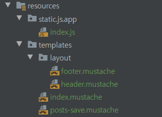

### 4.1 서버 템플릿 엔진과 머스테치 소개

- 템플릿 엔진이란
    - 지정된 템플릿 양식과 데이터로 html 문서 출력해줌
    - 서버 템플릿 엔진
        - JSP
    - 클라이언트 템플릿 엔진
        - React, Vue, SPA

- 머스테치란
    - 루비,js,파이썬,자바 등 많은 언어를 지원하는 심플한 템플릿 엔진
    - 문법이 심플
    - 로직 코드없이 View의 역할만 함
    - 하나의 문법으로 클라이언트/서버 템플릿을 모두 사용가능
    - mustache 플러그인 설치

### 4.2 기본 페이지 만들기 & 4.3 게시글 등록 화면 만들기

- `buile.gradle`에 `compile('org.springframework.boot:spring-boot-starter-mustache')`추가

- 

- template 코드 :<a href="https://github.com/jojoldu/freelec-springboot2-webservice/tree/master/src/main/resources/templates">https://github.com/jojoldu/freelec-springboot2-webservice/tree/master/src/main/resources/templates</a>

- `IndexController` 추가

```java
@Controller
public class IndexController { //mustache url 매핑

    @GetMapping("/")
    public String index(){
        return "index"; //index.mustache 페이지 매핑
    }

    @GetMapping("/posts/save")
    public String postsSave(){
        return "posts-save"; //posts-save.mustache 페이지 매핑
    }
}
```

### 4.4 전체 조회 화면 만들기

- `PostsRepository` 에 쿼리 추가

```java
public interface PostsRepository extends JpaRepository<Posts, Long> {
    @Query("SELECT p FROM Posts p ORDER BY p.id DESC")
    List<Posts> findAllDesc(); //JPA 에서 제공하지 않는 메소드는 쿼리로 작성가능
}
```

- `PostsService` 에 `findAllDesc()` 추가
```java
@RequiredArgsConstructor //Autowired가 없어도 주입되는 이유
@Service
public class PostsService {
    private final PostsRepository postsRepository;

    ...

    //readOnly=true : 트랜잭션 범위는 유지 + 조회기능만 남겨두어 조회속도 개선됨 
    // -> 등록,수정,삭제 기능이 없는 서비스 메소드에서 사용하는 것을 추천
    @Transactional(readOnly=true) 
    public List<PostsListResponseDto> findAllDesc(){
        return postsRepository.findAllDesc().stream()
                .map(PostsListResponseDto::new)
                .collect(Collectors.toList());
    }
}
```
- 조회된 리스트를 담을 `PostsListResponseDto`추가

```java
@Getter
public class PostsListResponseDto {
    private Long id;
    private String title;
    private String author;
    private LocalDateTime modifiedDate;

    public PostsListResponseDto(Posts entity){
        this.id=entity.getId();
        this.title=entity.getTitle();
        this.author=entity.getAuthor();
        this.modifiedDate = entity.getModifiedDate();
    }
}
```

- `IndexController`에서 mapping 변경

```java
@RequiredArgsConstructor
@Controller
public class IndexController { //mustache url 매핑

    private final PostsService postsService;
    
    @GetMapping("/")
    public String index(Model model){
        model.addAttribute("posts", postsService.findAllDesc()); //데이터를 posts로 index.mustache에 전달
        return "index"; //index.mustache 페이지 매핑
    }

    @GetMapping("/posts/save")
    public String postsSave(){
        return "posts-save"; //posts-save.mustache 페이지 매핑
    }
}
```
### 4.5 게시글 수정, 삭제 화면 만들기

- `posts-update` 화면 코드 : <a href="https://github.com/jojoldu/freelec-springboot2-webservice/blob/master/src/main/resources/templates/posts-update.mustache">https://github.com/jojoldu/freelec-springboot2-webservice/blob/master/src/main/resources/templates/posts-update.mustache</a>

<br>

- `IndexController`에 update mapping

```java
@RequiredArgsConstructor
@Controller
public class IndexController { //mustache url 매핑

    ...

    @GetMapping("/posts/update/{id}")
    public String postsUpdate(@PathVariable Long id, Model model){
        PostsResponseDto dto = postsService.findById(id);
        model.addAttribute("post", dto);

        return "posts-update"; //posts-update.mustache 페이지 매핑
    }
}
```

- `PostApiController` 에 수정, 삭제 추가

```java
@RequiredArgsConstructor
@RestController
public class PostsApiController {


    @PutMapping("/api/v1/posts/{id}")
    public Long update(@PathVariable Long id, @RequestBody PostsUpdateRequestDto requestDto){
        return postsService.update(id, requestDto);
    }

    @DeleteMapping("/api/v1/posts/{id}")
    public Long delete(@PathVariable Long id){
        postsService.delete(id);
        return id;
    }
}
```

- `PostsService`에 delete 추가

```java
@RequiredArgsConstructor //Autowired가 없어도 주입되는 이유
@Service
public class PostsService {
    private final PostsRepository postsRepository;

    ...

    @Transactional
    public void delete(Long id){
        Posts post = postsRepository.findById(id)
                .orElseThrow(()->new IllegalArgumentException("해당 게시글이 없습니다. id="+id));

        postsRepository.delete(post);
    }
}
```


